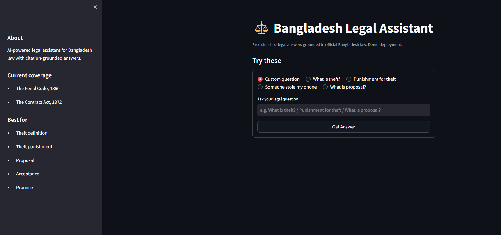
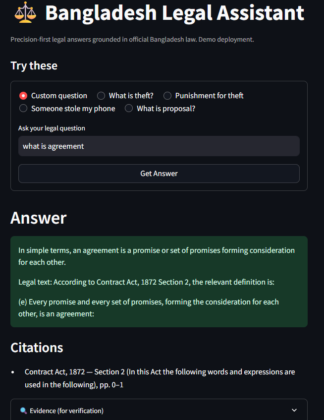

# Bangladesh Legal AI Assistant

RAG-based legal assistant for Bangladesh law with citation-grounded answers using hybrid retrieval (Chroma + BM25).  
Built with hybrid retrieval, Streamlit, Docker, and Hugging Face Spaces/Datasets.

## Live Demo
[Hugging Face Space](https://huggingface.co/spaces/bringerofdarkness/bd-legal-ai)

## Screenshots

### App Interface


### Answer with Citations


## Features
- Legal question answering
- Law-aware retrieval
- Citation-grounded responses
- Hybrid retrieval (vector + keyword)
- Docker-based deployment
- Remote vector DB loading from Hugging Face Dataset
- Evaluation pipeline with automated CI checks

## Demo Note
This is a public demo deployment. The system downloads its knowledge base at runtime and currently supports selected laws only.  
This project is for educational and portfolio purposes and does not provide legal advice.

## Current Law Coverage
- The Penal Code, 1860
- The Contract Act, 1872

## Tech Stack
- Python
- Streamlit
- Chroma
- BM25
- sentence-transformers
- LangChain
- Docker
- Hugging Face Spaces / Datasets
- GitHub Actions

## System Architecture
User → Streamlit UI → Retrieval pipeline → Chroma + BM25 → Answer generation + citations

## Evaluation

The system is evaluated using a custom test set of legal queries covering:

- Definition queries (for example, `define theft`)
- Punishment queries (for example, `punishment for theft`)
- Contract Act concept queries
- Out-of-scope refusal cases (for example, cybercrime-related queries)

### Results
- Total queries: 50
- Accuracy: 100% (50/50)
- Error breakdown: None

### Evaluation Features
- Checks for:
  - Response status (`ok` / `refused`)
  - Correct law identification
  - Correct section retrieval
- Provides structured error categorization:
  - `status_error`
  - `law_error`
  - `section_error`

### Current Evaluation Score
- Accuracy: **50/50 (100%)**
- Evaluated on curated legal queries across retrieval, routing, and refusal behavior
- CI automatically validates evaluation results on every push

### Reproducibility
Run evaluation locally:

```bash
python run_eval.py